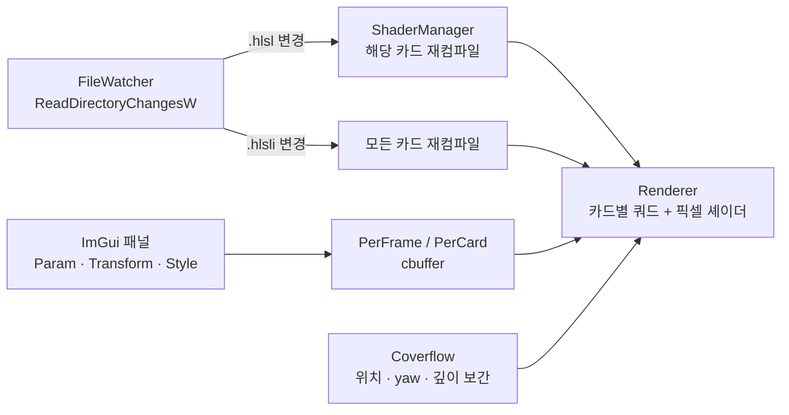

# sdf-playground — SDF Lab Cards

> DirectX 11과 HLSL로 Signed Distance Field(SDF)를 카드 한 장씩 실험하고, coverflow로 넘겨 보며 실시간으로 수정하는 셰이더 학습 앱


## 프로젝트 개요

SDF 함수(원·박스·별), 반복·회전·극좌표 변환, 부드러운 합성, 노이즈를 **카드 한 장 = 픽셀 셰이더 한 개** 단위로 익히는 Windows 데스크톱 앱입니다.
카드는 공통 HLSLI 라이브러리를 include해 짧게 작성합니다. 파일을 저장하면 실행 중인 앱에 바로 반영되므로, 수식을 바꾸고 결과를 보는 과정이 빠릅니다.
2D 도형 기초에서 시작해 노이즈·fBm 지형, 3D 레이마칭(sphere tracing, 볼륨 밀도 누적)까지 13장의 카드로 진행했습니다.

| 한눈에 보기 | |
|---|---|
| 분야 | 절차적 셰이더 · 2D/3D SDF · 노이즈 |
| 핵심 기술 | SDF 도형·연산자(smooth min), 도메인 반복·극좌표, Value/Gradient/Simplex 노이즈, fBm, Voronoi, sphere tracing |
| 렌더 방식 | 카드마다 쿼드 한 장 + 카드별 픽셀 셰이더, coverflow 3D 배치 |
| 개발 도구 | 파일 변경 이벤트 기반 핫 리로드, Dear ImGui 파라미터 패널, 카드 설정 저장 |
| 상태 | 카드 01~13 구현, 계속 추가 중 |

## 스크린샷

| | |
|---|---|
|  |  |
| **05** smooth min으로 합쳐지는 메타볼 | **10** simplex 노이즈로 경계가 흩어지는 삼각형 dissolve |
|  |  |
| **11** fBm 지형을 등고선 지도로 표현 | **12** sphere tracing 구 안의 3D Voronoi 볼륨 |

## 주요 기능

- **카드 덱**: 13장의 SDF 카드를 coverflow로 넘겨 보며 비교합니다. 가운데 카드가 편집 대상입니다.
- **셰이더 핫 리로드**: `.hlsl`/`.hlsli`를 저장하면 실행 중에 다시 컴파일합니다. 오류가 나면 마지막 정상 셰이더를 유지하고 오류 창을 띄웁니다.
- **런타임 파라미터**: 카드별 `Param.xyzw`, 이동·회전·크기, Fill/Stroke 스타일과 두 색을 ImGui로 조절합니다.
- **설정 저장**: 카드별 값을 `shaders/cards/card_settings.txt`에 저장하고 다시 불러옵니다.
- **애니메이션**: Pulse/Sine/Bounce/Oscillate 모드, 일시정지, 시간 배율. 카드는 가운데 슬롯에 도착했을 때부터 자기 시간을 누적합니다.
- **공통 SDF 라이브러리**: 도형·연산자·변환·마스크·색·애니메이션 HLSLI를 모든 카드가 공유합니다.

### 카드 목록

| 카드 | 주제 | 내용 |
|---|---|---|
| 01 | 도메인 반복 | 반복한 세로 줄을 움직이는 두 사인 곡선 사이에 가둠 |
| 02 | 거리장 변형 | 움직이는 원의 거리장이 주변 점 격자를 밀고 당김 |
| 03 | 극좌표 | 원 둘레를 16칸으로 나누고 칸 번호 기반 파동이 돌아감 |
| 04 | 격자 인덱스 애니메이션 | 6×6 원 격자의 행·열이 easing으로 차례로 밀림 |
| 05 | 부드러운 합성 | 공전하는 두 원을 smooth min으로 합친 메타볼 (`Param.x` = k) |
| 06 | 2D 변환 | 이동·크기·회전과 pivot 기준 로컬 좌표, 회전하는 십자 |
| 07 | Truchet 타일 | 10×10 칸마다 해시로 대각 삼각형을 무작위 뒤집기 |
| 08 | 2D 해시 | 행 단위 글리치: 무작위 속도 스크롤과 RGB 색 번짐 |
| 09 | Value / Gradient 노이즈 | 두 노이즈 비교, 노이즈로 회전하는 선 패턴과 번짐 |
| 10 | Simplex 노이즈 dissolve | 겹친 삼각형 경계를 3D simplex 노이즈로 흩어 불씨처럼 사라짐 |
| 11 | fBm 지형 | 등고선 지도 모드와 높이 → 법선 → 회전 태양 조명 모드 |
| 12 | 3D SDF 레이마칭 | 구를 sphere tracing으로 찾고 내부 3D Voronoi 밀도를 누적, 궤도 카메라 |
| 13 | 3D 회전 | 직육면체로 배우는 회전 순서(XYZ/ZYX), 자전과 공전, 월드·로컬 축 |

## 구현 포인트



- **카드 = 픽셀 셰이더**: 모든 카드는 같은 쿼드 정점 셰이더(`quad.vs.hlsl`)와 공용 `PSIn`을 쓰고, `main(PSIn) : SV_Target` 하나만 작성합니다. 목록은 `shaders/cards/card_files.txt`가 정합니다.
- **HLSLI 라이브러리** (`shaders/lib`):

  | 파일 | 역할 |
  |---|---|
  | `sdf_common.hlsli` | 공통 입력 구조와 좌표 변환 helper |
  | `sdf_cbuffers.hlsli` | PerFrame / PerCard 상수버퍼 |
  | `sdf_shapes.hlsli` | 기본 SDF 도형 |
  | `sdf_operators.hlsli` | union·subtract·intersection·smooth min/max |
  | `sdf_transform.hlsli` | rotate·scale·repeat·mirror·polar/kaleido |
  | `sdf_mask.hlsli` / `sdf_color.hlsli` | fill·stroke·soft 마스크와 팔레트 색 |
  | `sdf_animation.hlsli` | 시간 기반 애니메이션 helper |

- **핫 리로드**: 별도 스레드가 `shaders/`를 재귀 감시하고, 매 프레임 변경 이벤트를 처리합니다. 카드 파일은 그 카드만, `.hlsli`는 전체 카드를, `card_files.txt`는 카드 목록을 다시 불러옵니다. hlsli끼리 include할 수 있도록 커스텀 `ID3DInclude`를 사용합니다.
- **카드별 로컬 시간**: 가운데 슬롯에 온 카드만 시간을 누적해, 넘겨 온 순간부터 애니메이션이 시작됩니다.

## 빌드와 실행

**요구 환경**: Windows 10/11, Visual Studio 2022 (C++ 데스크톱 개발), Windows 10/11 SDK, CMake 3.20+

```powershell
git clone https://github.com/ryuhajin/sdf-playground.git
cd sdf-playground
cmake --preset vs2022-x64
cmake --build --preset debug      # Release는 --preset release
.\out\bin\Debug\SDFs.exe
```

- 실행 파일은 `out/bin/<Debug|Release>/SDFs.exe`에 생성됩니다. 셰이더 경로를 소스 폴더로 고정하므로 어느 위치에서 실행해도 됩니다.
- Visual Studio에서는 `out/build/vs2022-x64/SDFs.sln`을 열고 `F5`로 실행합니다.
- Dear ImGui는 `external/imgui`에 소스가 포함되어 있어 추가 설치가 필요 없습니다.
- **핫 리로드**: 앱을 켠 채 `shaders/cards/card_XX.hlsl`을 수정·저장하면 바로 반영됩니다. 새 카드를 만드는 방법은 [카드 작성 가이드](docs/CARD_AUTHORING.md)를 참고하세요.

## 조작

| 입력 | 동작 |
|---|---|
| `←` / `→` | 이전 / 다음 카드 |
| `Space` | 애니메이션 일시정지 / 재개 |
| `Esc` | 종료 |
| 마우스 | ImGui 패널 조작 (장면 카메라 조작은 없음) |

| "SDFs Deck" 패널 | 내용 |
|---|---|
| Render | GrayScale / Color × Hard / Gradient 렌더 모드, 배경색 |
| Cards | `<<` `>>` 이동, 편집 중인 카드, `Param.x~w`, Transform(X/Y·회전·크기), Style(Fill/Stroke/둘 다, Edge Softness, Stroke Width, Color 0/1), Save/Load/Reset |
| Animation | 애니메이션 모드, 일시정지, 시간 배율, 누적 시간 |
| Coverflow tuning | ±1/±2 카드의 간격·yaw·깊이·크기, 표시 범위, 보간 속도 |

## 프로젝트 구조

```text
sdf-playground/
├─ src/              # C++: App(창·입력·ImGui), Renderer, Coverflow, ShaderManager, FileWatcher
├─ shaders/
│  ├─ cards/         # card_01~13.hlsl, 카드 목록(card_files.txt), 카드 설정(card_settings.txt)
│  ├─ lib/           # 공통 SDF HLSLI 라이브러리
│  └─ quad.vs.hlsl   # 모든 카드가 쓰는 정점 셰이더
├─ docs/             # 가이드, ADR(decisions/), 기능 spec(specs/), CHANGELOG
└─ external/imgui/   # Dear ImGui (vendored)
```

## 문서

- [HLSL 카드 흐름](docs/HLSL_CARD_FLOW.md) — 카드 한 장을 쓰는 가장 단순한 사고 모델
- [카드 작성 가이드](docs/CARD_AUTHORING.md) — 카드 추가·수정 방법
- [현재 셰이더 모델](docs/CURRENT_SHADER_MODEL.md) — 카드 렌더링 구조 요약
- [card_12 3D SDF 가이드](docs/CARD_12_3D_SDF_GUIDE.md) — 가상 카메라, sphere tracing, 볼륨 레이마칭
- [작업 방식](docs/WORKFLOW.md) · [에이전트 가이드](docs/AGENT_GUIDE.md) · [변경 기록](docs/CHANGELOG.md)
- [설계 결정 기록(ADR)](docs/decisions/) · [기능 spec](docs/specs/)

## 참고 자료

- [Inigo Quilez — 2D distance functions](https://iquilezles.org/articles/distfunctions2d/) · [3D distance functions](https://iquilezles.org/articles/distfunctions/) · [smooth minimum](https://iquilezles.org/articles/smin/)
- [The Book of Shaders](https://thebookofshaders.com/) — 랜덤·노이즈(ch.10~11), 셀룰러 노이즈(ch.12), fBm(ch.13: card_11의 원본 예제)
- [Dear ImGui](https://github.com/ocornut/imgui)

## 관련 프로젝트

- [VolumetricCloud](https://github.com/ryuhajin/VolumetricCloud) — HLSL 레이마칭으로 만든 대규모 볼류메트릭 구름과 물리 대기
- [WaterShader](https://github.com/ryuhajin/WaterShader) — Sine wave·normal map·Fresnel 반사로 만든 스타일라이즈드 수면 셰이더
