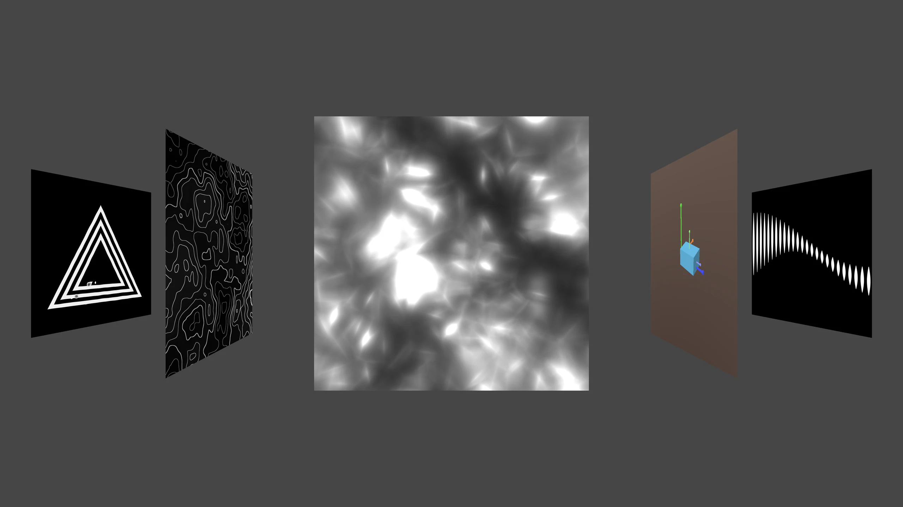

# sdf-playground — SDF Lab Cards

> DirectX 11과 HLSL로 Signed Distance Field(SDF)를 카드 한 장씩 실험하고, coverflow로 넘겨 보며 실시간으로 수정하는 셰이더 학습 앱


**프로젝트 페이지** · [ryuhajin.github.io/projects/sdfs](https://ryuhajin.github.io/projects/sdfs/) &nbsp;|&nbsp; **시연 영상** · [YouTube](https://youtu.be/Sd6XO_kqANc)



## 프로젝트 개요

SDF(Signed Distance Field)를 익히기 위해, 기법 하나를 **카드 한 장 = 픽셀 셰이더 한 개**에 담아 13장으로 쌓은 학습 앱입니다.
카드를 좌우로 넘겨 비교하고, 셰이더 파일을 저장하면 실행 중인 앱에 바로 반영됩니다.

| 한눈에 보기 | |
|---|---|
| 분야 | 절차적 셰이더 · 2D/3D SDF · 노이즈 |
| 핵심 기술 | SDF 도형·연산자(smooth min), 도메인 반복·극좌표, Value/Gradient/Simplex 노이즈, fBm, Voronoi, sphere tracing |
| 렌더 방식 | 카드마다 쿼드 한 장 + 카드별 픽셀 셰이더, coverflow 3D 배치 |
| 개발 도구 | 파일 변경 이벤트 기반 핫 리로드, Dear ImGui 패널(카드 전환·애니메이션 제어, 파라미터는 일부 카드만 반영), 카드 설정 저장 |
| 상태 | 카드 01~13 구현, 계속 추가 중 |

## 카드 목록

| 카드 | 이름 | 주제 | 내용 |
|---|---|---|---|
| 01 | Repetition | 도메인 반복 | 반복한 세로 줄을 움직이는 두 사인 곡선 사이에 가둠 |
| 02 | Dot Grid | 거리장 변형 | 움직이는 원의 거리장이 주변 점 격자를 밀고 당김 |
| 03 | Polar Rings | 극좌표 | 원 둘레를 16칸으로 나누고 칸 번호 기반 파동이 돌아감 |
| 04 | Tiling | 격자 인덱스 애니메이션 | 6×6 원 격자의 행·열이 easing으로 차례로 밀림 |
| 05 | Smooth Union | 부드러운 합성 | 공전하는 두 원을 smooth min으로 합친 메타볼 (`Param.x` = k) |
| 06 | Pivot & Rotation | 2D 변환 | 이동·크기·회전과 pivot 기준 로컬 좌표, 회전하는 십자 |
| 07 | Truchet | 결정론적 난수 | 10×10 칸마다 해시로 대각 삼각형을 무작위 뒤집기 |
| 08 | Glitch | 2D 해시 | 행 단위 글리치: 무작위 속도 스크롤과 RGB 색 번짐 |
| 09 | Domain Warp | Value / Gradient 노이즈 | 두 노이즈 비교, 노이즈로 회전하는 선 패턴과 번짐 |
| 10 | Triangle Dissolve | Simplex 노이즈 | 겹친 삼각형 경계를 3D simplex 노이즈로 흩어 불씨처럼 사라짐 |
| 11 | Topographic Map | fBm 지형 | value noise 6겹 fBm. 등고선 지도 모드와 높이 → 법선 → 회전 태양 조명 모드 |
| 12 | Volumetric Voronoi | 볼륨 레이마칭 | 구를 sphere tracing으로 찾고 내부 3D Voronoi 밀도를 24걸음 누적, 궤도 카메라 |
| 13 | Raymarch 3D | 3D SDF 레이마칭 | 직육면체를 레이마칭으로 그리고 Lambert 조명. 회전 순서(XYZ/ZYX), 자전과 공전, 월드·로컬 축 |

## 빌드와 실행

**요구 환경**: Windows 10/11, Visual Studio 2022 (C++ 데스크톱 개발), Windows 10/11 SDK, CMake 3.20+

```powershell
git clone https://github.com/ryuhajin/sdf-playground.git
cd sdf-playground
cmake --preset vs2022-x64
cmake --build --preset debug      # Release는 --preset release
.\out\bin\Debug\SDFs.exe
```

- 실행 파일은 `out/bin/<Debug|Release>/SDFs.exe`에 생성됩니다. 셰이더 경로를 소스 폴더로 고정하므로 어느 위치에서 실행해도 됩니다.
- Visual Studio에서는 `out/build/vs2022-x64/SDFs.sln`을 열고 `F5`로 실행합니다.
- Dear ImGui는 `external/imgui`에 소스가 포함되어 있어 추가 설치가 필요 없습니다.
- **핫 리로드**: 앱을 켠 채 `shaders/cards/card_XX.hlsl`을 수정·저장하면 바로 반영됩니다. 새 카드를 만드는 방법은 [카드 작성 가이드](docs/CARD_AUTHORING.md)를 참고하세요.

## 조작

| 입력 | 동작 |
|---|---|
| `←` / `→` | 이전 / 다음 카드 |
| `Space` | 애니메이션 일시정지 / 재개 |
| `Esc` | 종료 |
| 마우스 | ImGui 패널 조작 (장면 카메라 조작은 없음) |

## 프로젝트 구조

```text
sdf-playground/
├─ src/              # C++: App(창·입력·ImGui), Renderer, Coverflow, ShaderManager, FileWatcher
├─ shaders/
│  ├─ cards/         # card_01~13.hlsl, 카드 목록(card_files.txt), 카드 설정(card_settings.txt)
│  ├─ lib/           # 공통 SDF HLSLI 라이브러리
│  └─ quad.vs.hlsl   # 모든 카드가 쓰는 정점 셰이더
├─ docs/             # 가이드, ADR(decisions/), 기능 spec(specs/), CHANGELOG
└─ external/imgui/   # Dear ImGui (vendored)
```

## 문서

- [HLSL 카드 흐름](docs/HLSL_CARD_FLOW.md) — 카드 한 장을 쓰는 가장 단순한 사고 모델
- [카드 작성 가이드](docs/CARD_AUTHORING.md) — 카드 추가·수정 방법
- [현재 셰이더 모델](docs/CURRENT_SHADER_MODEL.md) — 카드 렌더링 구조 요약
- [card_12 3D SDF 가이드](docs/CARD_12_3D_SDF_GUIDE.md) — 가상 카메라, sphere tracing, 볼륨 레이마칭
- [작업 방식](docs/WORKFLOW.md) · [에이전트 가이드](docs/AGENT_GUIDE.md) · [변경 기록](docs/CHANGELOG.md)
- [설계 결정 기록(ADR)](docs/decisions/) · [기능 spec](docs/specs/)

## 참고 자료

- [Inigo Quilez — 2D distance functions](https://iquilezles.org/articles/distfunctions2d/) · [3D distance functions](https://iquilezles.org/articles/distfunctions/) · [smooth minimum](https://iquilezles.org/articles/smin/)
- [The Book of Shaders](https://thebookofshaders.com/) — 랜덤·노이즈(ch.10~11), 셀룰러 노이즈(ch.12), fBm(ch.13: card_11의 원본 예제)
- [PixelSpiritDeck](https://github.com/patriciogonzalezvivo/PixelSpiritDeck) — 셰이더 하나를 카드 한 장으로 정리하는 아이디어
- [Dear ImGui](https://github.com/ocornut/imgui)
